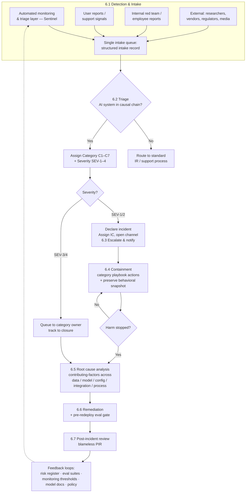

# AI Incident Response Playbook

**Meridian Digital Assets** — Trust & Safety / AI Governance

> *Portfolio note: Meridian Digital Assets is a fictional digital-asset trading and custody platform used to ground this playbook in a realistic operating context. All document-control metadata — owner, approver, status, version history — is part of that fictional scenario, illustrating how the playbook would live inside a real governance structure. The process, taxonomy, and templates are designed to be adopted by any organization deploying AI systems: replace the illustrative systems (§1.2) and role holders with your own.*

---

## 0. Document Control

| Field | Value |
|---|---|
| Document ID | MDA-TS-PB-014 |
| Version | 1.2 |
| Status | Approved |
| Owner | Head of Trust & Safety |
| Approver | Chief Risk Officer |
| Review cadence | Semi-annual, and after every SEV-1/SEV-2 post-incident review |
| Applies to | All production AI systems operated by Meridian (§1.2) |
| Related documents | Enterprise Incident Response Plan (MDA-SEC-PL-002); Data Breach Response Procedure (MDA-PRV-PR-005); AI Risk Register (MDA-GOV-RR-001); Model Inventory (MDA-GOV-INV-003); Business Continuity & Disaster Recovery Plan (MDA-BCP-PL-001); per-category incident runbooks (MDA-TS-RB-001…007, pattern in Appendix F) |

### Version history

| Version | Date | Author | Change summary |
|---|---|---|---|
| 0.1 | 2026-05-12 | T&S Operations | Initial draft |
| 0.9 | 2026-06-18 | T&S Operations | Incorporated Legal, Privacy, ML Engineering review |
| 1.0 | 2026-07-07 | T&S Operations | Approved by CRO; effective |
| 1.1 | 2026-07-07 | T&S Operations | Added Appendix E (tooling reference: Sentinel); clarified human ratification of automated triage (§6.2). No normative process change |
| 1.2 | 2026-07-07 | T&S Operations | Incorporated external governance review: materiality thresholds (§1.3), Shadow AI scope, declaration & decision authority (§3.4), severity calibration worksheet (§5.2), triage dispositions (§6.2), communication matrix (§6.3), containment SLAs, chain of custody and C7 supplement (§6.4), closure/reopening rules (§6.6), risk-register linkage (§6.7), program metrics (§7), runbook exemplar (Appendix F) |

---

## 1. Purpose, Scope & Definitions

### 1.1 Purpose

This playbook defines how Meridian detects, triages, contains, and learns from incidents involving its AI systems. It exists so that:

- Any responder can determine, within minutes, **what kind of incident they are facing, how severe it is, and who owns the next action.**
- AI incidents are handled with the same operational rigor as security and financial incidents — with SLAs, evidence preservation, and auditable records.
- Every incident feeds structured learning back into Meridian's AI risk management program, closing the loop required by NIST AI RMF (MANAGE → GOVERN/MAP) and ISO/IEC 42001 (Clause 10.2, corrective action).

### 1.2 Systems in scope

All production AI systems in the Model Inventory, currently:

| System | Type | Function | Key dependencies | Risk tier |
|---|---|---|---|---|
| **FALCON** | Supervised ML (in-house) | Fraud & AML transaction monitoring; can hold transactions and freeze accounts | Feature store; transaction pipeline; training pipeline | High |
| **ARIA** | LLM assistant (third-party foundation model + RAG) | Customer support chat; account and product guidance | Foundation-model provider API; RAG index / vector DB; account-lookup tools; auth service | High |
| **KYC-Vision** | Vendor ML service | Identity document verification during onboarding | Vendor API; document ingestion pipeline | High |

*The dependency column exists for impact analysis: a C7 incident in any listed dependency inherits the risk tier of the systems that depend on it.*

### 1.3 What is an AI incident?

An **AI incident** is any event where an AI system's behavior, data, or availability causes or credibly threatens harm to users, the organization, or third parties — including harmful or policy-violating outputs, discriminatory outcomes, privacy exposure, security compromise of the model or its pipeline, and material performance failure.

Four boundary rules keep this definition operational:

1. **AI incidents often arrive disguised as ordinary tickets.** A cluster of support complaints ("the bot told me to send funds to this address"), a spike in false-positive account freezes, or a chargeback anomaly may all be AI incidents. Triage (§6.2) explicitly asks: *is an AI system in the causal chain?*
2. **Dual-track incidents run under both plans.** If an AI incident is also a security breach or personal-data breach, this playbook governs the AI-specific response (model containment, behavioral RCA) while the Enterprise IR Plan and Data Breach Procedure govern their domains. One Incident Commander coordinates both tracks — never two parallel commands.
3. **Near-misses are in scope.** An event caught before user impact (e.g., red-team discovers a jailbreak pre-release, a guardrail catches a harmful output) is logged as a near-miss (SEV-4-NM, §5.3) and receives a lightweight review. Near-misses are the cheapest learning the program gets.
4. **Unsanctioned AI use ("Shadow AI") is in scope.** An incident caused by an AI system *outside* the Model Inventory — e.g., an employee pasting customer data into an unapproved external AI tool, or a team quietly wiring a third-party model into a workflow — is handled under this playbook (classified normally; most often C3) and additionally triggers an inventory action: the AI Governance Lead is accountable for bringing the tool into governance or blocking it, and the gap in inventory controls becomes a mandatory PIR finding.

**Materiality thresholds.** "Material" and "credibly threatens" are operationalized as per-system monitoring thresholds; crossing one creates an intake record — an *incident candidate* (§3.4, §6.2) — never silently. Illustrative defaults:

| Signal | Default trigger threshold |
|---|---|
| Validated harmful or policy-violating output reaching a user | Any single occurrence |
| False-positive rate on automated holds/freezes (FALCON) | > 20% over 7-day baseline |
| Accuracy/precision on golden evaluation set | > 5 pp degradation |
| Latency / availability | > 2× baseline p95, or SLO breach |
| Guardrail block rate (ARIA) | > 3× daily baseline |
| Outcome disparity across monitored segments (§ C5) | Outside the control band defined per system |

*Actual values are calibrated per system in the Model Inventory monitoring configuration and reviewed quarterly by the AI Incident Review Board — thresholds hard-coded in a policy document drift out of date; the obligation here is that thresholds exist, are documented, and alert into intake.*

### 1.4 Definitions & abbreviations

| Term | Definition |
|---|---|
| **AI system** | Any production system that includes a machine-learned model or LLM in its decision or output path, including vendor-provided services. |
| **Incident Commander (IC)** | The single accountable coordinator of an incident from declaration to closure. |
| **Model Owner** | The named individual accountable for a specific AI system's performance and risk posture (per Model Inventory). |
| **Containment** | Any action that stops or limits ongoing harm, independent of root cause (e.g., rollback, kill switch, filter patch). |
| **Behavioral snapshot** | Preserved evidence of model behavior at incident time: model/version identifiers, prompts and configuration, inputs/outputs, retrieval context, and logs. |
| **Near-miss** | An event that could plausibly have become a SEV-1–3 incident but was caught before user impact. |

**Abbreviations:** DPO — Data Protection Officer · IC — Incident Commander · IR — Incident Response · MTTC — Mean Time to Containment · MTTD — Mean Time to Detection · MTTR — Mean Time to Resolution · NM — Near-Miss · PII — Personally Identifiable Information · PIR — Post-Incident Review · RACI — Responsible/Accountable/Consulted/Informed · RAG — Retrieval-Augmented Generation · RCA — Root Cause Analysis · SLA — Service Level Agreement · SOP — Standard Operating Procedure · T&S — Trust & Safety.

---

## 2. Framework Alignment

This playbook is organized by incident lifecycle, because that is how responders use it. The table below maps each phase to the NIST AI RMF functions and ISO/IEC 42001 requirements it operationalizes, so auditors and governance reviewers can trace coverage.

| Playbook element | NIST AI RMF | ISO/IEC 42001 |
|---|---|---|
| Governance, roles & RACI (§3) | GOVERN 2 (roles, responsibilities, accountability); GOVERN 4.3 (incident identification and information-sharing practices) | A.3.2 AI roles and responsibilities; Clause 5.3 organizational roles |
| Taxonomy & severity (§4–5) | MAP 5.1 (likelihood and magnitude of impacts); MEASURE 3.1 (tracking identified risks) | A.5 AI system impact assessment (severity dimensions derive from impact assessments) |
| Detection & intake (§6.1) | MEASURE (ongoing monitoring); MEASURE 3.3 (end-user feedback and reporting channels); MANAGE 4.1 (post-deployment monitoring) | A.6.2.6 AI system operation and monitoring |
| Triage & escalation (§6.2–6.3) | MANAGE 2.3 (respond to previously unknown risks); MANAGE 4.3 (incident communication to relevant actors) | A.8.4 communication of incidents; Clause 7.4 communication |
| Containment & response (§6.4) | MANAGE 2.4 (mechanisms to supersede, disengage, or deactivate AI systems) | A.6.2.6; A.10.3 supplier arrangements (vendor-model containment) |
| RCA & remediation (§6.5–6.6) | MEASURE 2 (evaluation of trustworthy characteristics); MANAGE 1 (risk treatment) | Clause 10.2 nonconformity and corrective action |
| Post-incident review & feedback loops (§6.7, §7) | MANAGE 4.2 (continual improvement); GOVERN 1 (policies updated from experience); MAP (context re-assessment) | Clause 9 performance evaluation; Clause 10 continual improvement |
| Regulatory notification (§6.3) | GOVERN 1.1 (legal and regulatory requirements) | A.8.4; Clause 4.2 interested parties |

*Control references reflect NIST AI RMF 1.0 and ISO/IEC 42001:2023; organizations adopting this playbook should validate mappings against their certification scope.*

---

## 3. Governance, Roles & RACI

### 3.1 Role definitions

| Role | Held by | Responsibilities in an incident |
|---|---|---|
| **Incident Commander (IC)** | Trained on-call rotation (T&S Ops leads, SecOps leads) | Declares/classifies the incident, runs the response, owns comms cadence, decides containment with Model Owner, closes the incident. One IC per incident, including dual-track incidents. |
| **Model Owner** | Named per system in Model Inventory | Technical authority on the affected system; executes/validates containment; leads behavioral RCA. |
| **ML Engineering on-call** | Engineering rotation | Executes rollbacks, flag changes, filter patches; preserves behavioral snapshots. |
| **AI Governance Lead** | Responsible AI function | Assesses fairness/policy dimensions; owns risk-register and model-documentation updates; ensures regulatory analysis happens for reportable incidents. |
| **Privacy Officer / DPO** | Privacy | Determines whether personal data is involved; owns breach-notification clocks. |
| **Legal & Compliance** | Legal | Regulatory reporting decisions; litigation hold; sanctions/AML implications. |
| **Communications** | Comms/Support leadership | User-facing messaging, status page, support macros, media response. |
| **Executive Sponsor** | CRO (delegate: CTO) | Informed on SEV-1/2; tie-breaks cross-functional containment disputes (e.g., revenue vs. safety). |

### 3.2 RACI by lifecycle phase

R = Responsible, A = Accountable, C = Consulted, I = Informed

| Phase | IC | Model Owner | ML Eng | AI Gov Lead | Privacy | Legal | Comms | Exec |
|---|---|---|---|---|---|---|---|---|
| Detection & intake | R | I | I | I | — | — | — | — |
| Triage & severity | **A**/R | C | C | C | C | — | — | I |
| Escalation & notification | **A** | I | I | C | R | R | R | I |
| Containment | **A** | R | R | C | C | C | I | I |
| RCA | C | **A**/R | R | C | C | — | — | I |
| Remediation & verification | C | **A**/R | R | C | — | — | — | I |
| Post-incident review | R | R | C | **A** | C | C | C | I |
| Regulatory reporting | C | C | — | C | R | **A** | I | I |

Two deliberate accountability splits: the **IC is accountable for the response** (speed, coordination, containment decisions), while the **Model Owner is accountable for the fix** (RCA quality, remediation), and the **AI Governance Lead is accountable for the learning** (PIR completion, risk-register integration). This prevents the common failure where the team that ships the fix also grades its own homework.

### 3.3 Standing governance

- **AI Incident Review Board** — AI Governance Lead (chair), Head of T&S, Model Owners, Privacy, Legal. Meets monthly: reviews all incidents and near-misses, approves PIR action closure, tunes this playbook.
- **On-call and readiness** — IC rotation staffed 24/7; every IC completes incident-command training and a tabletop exercise before joining rotation. One AI-specific tabletop per quarter (scenarios rotate through taxonomy categories §5.1).

### 3.4 Declaration & decision authority

**Anyone can raise; few can declare.** Raising an *incident candidate* (an intake record, §6.1) is open to every employee, system, and external reporter — reporting is never gated. *Declaring* an incident — assigning severity and activating the response machinery — is restricted, so that a mistaken candidate costs a triage review, not a war room:

| Action | Authorized |
|---|---|
| Raise an incident candidate | Anyone (employee, automated monitoring, external reporter) |
| Declare & classify an incident | On-call IC; Head of T&S; SecOps lead |
| Containment rungs 1–3 (filters, capability disable, rate-limit) | Model Owner **or** IC |
| Containment rungs 4–5 (rollback, human-in-the-loop) | IC **and** Model Owner jointly |
| Containment rung 6 (kill switch) | IC **and** Model Owner jointly; Executive Sponsor informed immediately — activation must never wait on executive availability |
| Overrule a containment decision on business grounds | Executive Sponsor only, in writing, recorded in the incident timeline |
| Close an incident | IC with Model Owner confirmation; SEV-1/2 require AI Governance Lead co-sign (§6.6) |
| Reopen an incident | Same authority as declaration (§6.6) |

The kill-switch rule encodes the design intent explicitly: **the authority to stop harm is pre-delegated downward; only the authority to accept continued risk escalates upward.**

---

## 4. Design of the Classification System

Every incident is classified on **two independent axes**:

- **Category (C1–C7)** — *what kind of incident* → selects the containment playbook and the specialist roles pulled in.
- **Severity (SEV-1–SEV-4)** — *how bad* → selects response speed, escalation depth, and communication obligations.

The axes are orthogonal by design. A prompt-injection proof-of-concept with no user impact is C4/SEV-4; a fraud-model outage silently approving transactions is C2/SEV-1. Conflating type with severity — a common flaw in AI incident taxonomies — either over-escalates trivia or under-escalates quiet catastrophes.

---

## 5. AI Incident Taxonomy & Severity Classification

### 5.1 Incident categories

| Code | Category | Definition | Meridian examples |
|---|---|---|---|
| **C1** | Harmful or policy-violating output | AI output that violates content policy or facilitates harm reaching users | ARIA provides seed-phrase "recovery" instructions that enable self-custody theft; ARIA generates advice facilitating self-harm |
| **C2** | Model performance failure | Material degradation in accuracy, reliability, or availability | FALCON false-positive spike freezes 3,000 legitimate accounts; FALCON silently degrades and misses fraud patterns; ARIA hallucination rate spikes after a vendor model update |
| **C3** | Data & privacy | AI system exposes, leaks, or misuses personal or confidential data | ARIA reveals another customer's balance via retrieval bug; training data with PII found memorized and extractable |
| **C4** | Security compromise | Adversarial attack on the AI system or its pipeline with actual or credible impact | Prompt injection exfiltrates data through ARIA's tool access; data poisoning of FALCON's training pipeline; model weights or system prompts exfiltrated |
| **C5** | Bias & fairness | Discriminatory or systematically inequitable outcomes across user groups | KYC-Vision rejection rates materially higher for documents from specific regions; FALCON freeze rates show unexplained disparity across demographic proxies |
| **C6** | Misuse & abuse | External actors weaponizing the AI system against others | Fraud rings using ARIA to social-engineer refunds at scale; coordinated probing to reverse-engineer FALCON thresholds for structuring |
| **C7** | Third-party / supply chain | Incident originating in an upstream AI vendor or dependency | Foundation-model provider ships a behavior-changing update without notice; KYC-Vision vendor breach; vendor API deprecation breaking production |

An incident may span categories (a successful prompt injection that exposes PII is C4 + C3). Classify by **primary harm vector**, tag secondaries — the primary drives the containment playbook, tags drive which specialists join.

### 5.2 Severity levels

Severity is scored against five impact dimensions: **harm to users** (financial, physical, psychological), **scale** (blast radius), **legal & regulatory exposure**, **reversibility**, and **whether exposure is ongoing**.

| Level | Definition | Anchors (any one suffices) | Response posture |
|---|---|---|---|
| **SEV-1 Critical** | Severe, widespread, or irreversible harm; existential regulatory/trust exposure; harm ongoing | Active financial loss to users at scale; PII exposure affecting >1% of users; harmful output causing risk to life; regulator-reportable security compromise in progress | Immediate IC + war room; exec notified ≤ 1 h; all-hands containment; external comms prepared |
| **SEV-2 High** | Significant harm to a meaningful user population, or severe harm to few; contained or containable | Hundreds of accounts wrongly frozen; single confirmed PII exposure with sensitive data; jailbreak class reproducible in production | IC assigned; exec informed same day; containment within defined SLA |
| **SEV-3 Moderate** | Limited harm, small blast radius, reversible | Localized quality degradation; offensive (non-dangerous) outputs affecting few users; vendor latency degrading UX | Handled in queue by category owner; IC optional; tracked to closure |
| **SEV-4 Low** | Minimal or no user impact; cosmetic or fully mitigated | Guardrail caught the bad output; single hallucination with no action taken on it | Logged, batched review |
| **SEV-4-NM Near-miss** | No user impact, but a plausible path to SEV-1–3 existed | Red team finds production jailbreak pre-exploitation; pipeline bug caught in canary | Logged with mandatory lightweight review (§6.7) |

**Classification rules (from T&S triage discipline):**

1. **Default up.** Uncertain between two levels → take the higher. Downgrading later is cheap; upgrading late is not.
2. **Severity is provisional and re-evaluated** at every status cadence. Scope discovery frequently upgrades AI incidents (what looks like one bad output is often a class of bad outputs).
3. **Ongoing exposure floors severity at SEV-2.** If harm is still occurring and uncontained, it cannot be SEV-3/4 regardless of current known scale.
4. **Silent failures get special suspicion.** A model failing *quietly* (FALCON missing fraud, not flagging too much) has unbounded scale until proven otherwise — triage must estimate exposure window, not just observed impact.

**Severity calibration worksheet (tie-breaker).** When two responders disagree, or no anchor obviously fits, score the impact dimensions and map the total:

| Dimension | Score range |
|---|---|
| Harm to users (financial, physical, psychological) | 0–4 |
| Scale / blast radius | 0–4 |
| Legal & regulatory exposure | 0–4 |
| Irreversibility | 0–2 |
| Ongoing exposure | 0–2 |

**Mapping:** total ≥ 12 → SEV-1 · 8–11 → SEV-2 · 4–7 → SEV-3 · ≤ 3 → SEV-4.

The worksheet is a **calibration aid, not the primary method** — the anchors and the default-up rule prevail (numeric scoring of ambiguous situations creates false precision if treated as authoritative). Each use is noted in the incident record; recurring disagreement on the same scenario type is taxonomy feedback for the AI Incident Review Board.

### 5.3 Category × severity worked examples

| Scenario | Category | Severity | Why |
|---|---|---|---|
| ARIA instructs a user to move funds to a "verification wallet" (scam pattern in retrieved content); 40 users saw it, 3 complied | C1 (+C6) | SEV-1 | Irreversible financial harm, ongoing until contained |
| FALCON update triples false positives overnight; 3,000 accounts frozen | C2 | SEV-2 | Large scale but reversible; harm is inconvenience + trust, not loss |
| Researcher responsibly discloses ARIA system-prompt extraction; no evidence of exploitation | C4 | SEV-3 | Real vulnerability, no current harm; drives remediation not war room |
| Internal audit finds KYC-Vision approval-rate disparity by document origin | C5 | SEV-2 | Systemic, legally exposed, affects access to financial services; not "ongoing acute" but floor rules apply given continuing decisions |
| Canary deploy catches FALCON scoring inversion before full rollout | C2 | SEV-4-NM | Zero impact; mandatory near-miss review because full rollout would have been SEV-1 |

---

## 6. Incident Lifecycle



### 6.1 Detection & Intake

**Objective:** every potential AI incident, from any source, lands in one queue as a structured record within minutes of detection.

**Detection channels:**

| Channel | Examples | Route |
|---|---|---|
| **Automated monitoring & triage layer** *(current implementation: Sentinel — Appendix E)* | Output-safety classifiers on ARIA; drift and score-distribution monitors on FALCON; anomaly detection on freeze/approval rates; guardrail-block spikes | Auto-creates intake record with telemetry attached; high-confidence detections page directly |
| User reports | Support tickets, in-product "report this response" on ARIA, appeal volumes | Support triage flags AI-suspect tickets via macro; clusters auto-escalate |
| Internal | Red-team findings, employee reports, canary/eval failures, pre-deploy checks | Direct intake form |
| External | Security researchers (disclosure program), vendor notifications (contractually required for C7 — see §6.3), regulators, media, social monitoring | On-call IC creates record; external-origin incidents start triage at elevated priority |

**Intake record minimum fields:** detection source and time; affected system(s) and version identifiers; observed behavior (verbatim where possible); scope indicators (users affected, ongoing?); reporter contact; initial evidence links. *(Template: Appendix A, section 1.)*

**Discipline that makes this work:**

- **One queue.** AI-suspect signals from support, security, and monitoring converge into a single intake view — fragmented intake is the leading cause of late detection of slow-burn incidents (bias, drift, quiet abuse).
- **Low reporting friction, no reporting penalty.** Anyone at Meridian can file in under two minutes. False alarms are explicitly welcomed and never criticized; the near-miss reviews (§6.7) reinforce this.
- **Immediate evidence capture.** The intake step triggers the behavioral snapshot (§6.4) *before* anyone attempts fixes — AI behavior is often non-deterministic and version-dependent; evidence not captured at detection may be unreproducible after a config change or vendor update.

### 6.2 Triage & Severity Assignment

**Objective:** within SLA, answer four questions and route accordingly.

| # | Question | Output |
|---|---|---|
| 1 | Is an AI system in the causal chain? | If no → standard IR/support routing. If unclear → treat as yes until shown otherwise |
| 2 | What is the primary harm vector? | Category C1–C7 (+ secondary tags) |
| 3 | How bad is it, and is it ongoing? | Severity per §5.2, applying default-up and ongoing-exposure rules |
| 4 | Is this one instance or a class? | Scope estimate: an LLM producing one bad output has usually produced others — triage searches logs for the *pattern*, not the *example* |

**Triage SLAs:**

| Signal priority | Acknowledge | Classify & route |
|---|---|---|
| Paged (automated high-confidence, or external regulator/media) | 15 min | 1 h |
| Standard queue | 4 h | 1 business day |

**Triage dispositions.** Not every candidate becomes an incident. Candidates that fail question 1, or where no incident is found, are closed at triage with an explicit disposition: **Rejected** (not an incident — e.g., human error unrelated to any AI system), **False Positive** (monitoring fired incorrectly — feeds the monitoring-precision metric, §7), or **Duplicate / Merged** (linked into an existing incident). Dispositioned candidates remain queryable — a cluster of "rejected" reports about the same behavior is itself a detection signal.

**Automated pre-classification is a suggestion, not a decision.** Intake records created by Sentinel arrive with a suggested category and severity. The suggestion accelerates triage; it never replaces it — a human triager ratifies or overrides every classification before routing, and accountability for the call remains with the IC per §3.2. Overrides are logged and feed the severity re-grade metric (§7), which doubles as calibration data for the tool itself.

**Dual-track determination happens here:** if personal data may be involved, Privacy is pulled in at triage (not after containment) because notification clocks (§6.3) may already be running. Same for Legal if the incident is plausibly regulator-reportable.

### 6.3 Escalation & Notification

**Internal escalation matrix:**

| Severity | IC | Executive | War room | Status cadence |
|---|---|---|---|---|
| SEV-1 | Immediately assigned | CRO + CTO ≤ 1 h; CEO informed same day | Yes, dedicated channel + bridge | Every 2 h until contained, then daily |
| SEV-2 | Assigned ≤ 2 h | CRO same business day | Dedicated channel | Daily |
| SEV-3 | Optional (category owner leads) | Monthly roll-up | — | At state changes |
| SEV-4 / NM | — | Monthly roll-up | — | On closure |

Escalation is **severity-driven and automatic** — the matrix removes the judgment call (and the social friction) of "should I wake someone up." Any responder may also escalate one level on judgment; no one may de-escalate below the matrix.

**External notification clocks** (owned by Legal + Privacy, assessed at triage):

| Trigger | Obligation (illustrative) | Clock |
|---|---|---|
| Personal data breach (C3, some C4) | Data-protection regulator notification (e.g., GDPR Art. 33) | 72 h from awareness |
| Serious AI incident under applicable AI regulation | e.g., EU AI Act Art. 73 serious-incident reporting for high-risk systems | 2–15 days depending on incident nature |
| Financial-regulatory triggers | SAR filings; prudential notification for operational incidents affecting customer funds | Per jurisdiction |
| Contractual | Notification to enterprise customers, partners; **inbound**: vendors must notify Meridian of C7-relevant events per contract | Per contract |
| Affected users | Direct notice where legally required or where trust demands it | Comms leads, Legal approves |

The playbook's job is not to enumerate every jurisdiction — it is to guarantee the **question is asked at triage** and a named owner runs each clock.

**Communication matrix (who speaks to whom):**

| Audience | Drafts | Approves | Channel |
|---|---|---|---|
| Responders & leadership | IC | IC | Incident channel; status cadence per §6.3 matrix |
| All staff | Comms | Head of T&S | Internal broadcast |
| Affected users | Comms + Support | Legal + Comms lead | Direct notice; support macros |
| All users / public | Comms | Executive Sponsor + Legal | Status page; public post |
| **Media** | Comms (sole voice) | Executive Sponsor + Legal | Press statement — **no one else speaks to press** |
| Regulators | Legal | Legal (Privacy for data breaches) | Formal filing per notification clocks above |
| Vendors (C7) | Model Owner | IC | Vendor incident-SLA channel |

Incident records, evidence, and communications drafts are classified **Confidential — Incident** by default; sharing beyond this matrix requires Legal approval.

### 6.4 Containment & Response

**Objective: stop the harm first.** Containment is decoupled from diagnosis — you do not need to know *why* the model is misbehaving to stop it from misbehaving. The IC owns the containment decision; the Model Owner validates technical feasibility; disputes go to the Executive Sponsor (safety outranks revenue by default).

**Containment options ladder** (least to most disruptive):

1. Tighten output filters / guardrail thresholds
2. Disable specific capabilities (tool access, retrieval sources, response topics)
3. Rate-limit or restrict affected user segments / transaction types
4. Roll back to last known-good model/prompt/config version
5. Degrade to human-in-the-loop (model advises, human decides)
6. **Kill switch:** disable the AI system entirely, fail over to manual process

Every production AI system at Meridian **must have options 4–6 tested quarterly** (this is the operational meaning of NIST AI RMF MANAGE 2.4). A kill switch that has never been pulled in an exercise is a hypothesis, not a control.

**Containment SLAs and targets:**

| Severity | Containment initiated (hard SLA) | Harm stopped (target) |
|---|---|---|
| SEV-1 | ≤ 30 min from declaration | ≤ 4 h |
| SEV-2 | ≤ 2 h | ≤ 1 business day |
| SEV-3 | ≤ 1 business day | Per category-owner plan |

"Initiated" means the first ladder action is executed — that is a hard SLA. "Harm stopped" is a **target, not a guarantee**: no one can promise a deadline for containing the not-yet-understood, and pretending otherwise produces paper compliance. Instead, missing the target has a defined consequence — the incident escalates one severity level and the Executive Sponsor engages directly.

**Category-specific first moves:**

| Category | Default containment | Category-specific cautions |
|---|---|---|
| C1 Harmful output | Filter patch or capability disable; kill switch if harm is severe | Search logs for the full output class, not the reported instance; contact affected users where output was actionable |
| C2 Performance failure | Rollback to last known-good; human-in-the-loop for decisions in flight | For *silent* failures, quantify the exposure window; queue affected decisions (e.g., unfrozen fraud, wrongly frozen accounts) for remediation sweep |
| C3 Data & privacy | Disable the leaking path (retrieval source, logging sink); preserve evidence | Do **not** delete leaked-data logs before Privacy/Legal review — containment must not destroy breach-scope evidence |
| C4 Security compromise | Revoke/rotate credentials and tool access; isolate pipeline; treat inputs as adversarial | Coordinate with SecOps under Enterprise IR; assume the reported vector is not the only one |
| C5 Bias & fairness | Human-in-the-loop for affected decision class; do not "quick-fix" thresholds without analysis | Hasty threshold patches can shift, not remove, disparity; interim manual review protects users while RCA runs |
| C6 Misuse & abuse | T&S abuse controls: rate limits, friction, account actions on abusing cohort | Contain the *abusers*, not just the model; feed patterns to fraud ops |
| C7 Third-party | Pin versions; activate fallback vendor/manual path; invoke vendor incident SLA | Meridian remains accountable to its users and regulators regardless of vendor fault — never wait on a vendor to begin containment |

**C7 supplement — contractual track.** Vendor incidents run on two tracks: the technical track above, and a contractual track activated by Legal with the Model Owner: (1) invoke the vendor's incident SLA and demand a vendor RCA; (2) exercise contractual audit/information rights; (3) verify the vendor met its own notification obligation — a missed notification is itself a PIR finding and contract-renewal input; (4) for recurring incidents, trigger the documented exit plan (ISO/IEC 42001 A.10.3). C7 incidents are **sub-tagged by origin** — *foundation model · infrastructure · model component (embeddings, vector DB, safety classifiers, OCR) · integrated tool* — so vendor-concentration risk becomes visible in §7 reporting.

**Evidence preservation (mandatory before any fix ships):** the behavioral snapshot — model and version IDs, system prompts and configuration, guardrail settings, the triggering inputs/outputs, retrieval context, relevant logs, and (for C4/C3) forensic copies per Enterprise IR evidence standards. Non-determinism means *the incident state may be unreproducible after any change*. Snapshot first, fix second.

**Chain of custody (mandatory for C3/C4; recommended for all SEV-1/2):** every evidence item is logged with an evidence ID, collector, collection timestamp, SHA-256 hash, storage location, and access log (template: Appendix A §4). In a financial-services context, evidence that cannot demonstrate custody may be unusable in regulatory proceedings — collection discipline at hour one protects options months later.

**Exit criterion:** containment is complete when harm is verifiably stopped — confirmed by monitoring, not by assumption ("we shipped the filter" is not "the outputs stopped"). The IC then formally transitions the incident from *response* to *investigation*.

### 6.5 Root Cause Analysis

**Objective:** understand why the incident happened and why it wasn't caught earlier, well enough that remediation prevents the *class*, not just the instance.

Classic single-chain RCA ("5 whys") maps poorly onto AI systems: model behavior is probabilistic, emergent from data, and often has no single defective line of code. Meridian uses **contributing-factors analysis** across five layers, expecting findings in several:

| Layer | Questions | Example findings |
|---|---|---|
| **Data** | Training/fine-tuning data quality? Retrieval corpus poisoned, stale, or misindexed? Input distribution shifted? | ARIA's RAG index ingested a scam page from a compromised help-center article |
| **Model** | Version change? Known failure mode? Behavior drift? Vendor update? | Vendor foundation-model update changed refusal behavior without notice |
| **Prompt & configuration** | System prompt, guardrail thresholds, decoding parameters, feature flags? | Guardrail threshold loosened in an unrelated A/B test |
| **Integration** | Tool access, orchestration, upstream/downstream services, permissions? | ARIA's account-lookup tool lacked per-session authorization binding |
| **Human & process** | Was the risk known? Why did testing/monitoring miss it? Were warnings ignored? SOP gaps? | Red-team finding from March was ticketed but deprioritized; no eval covered this output class |

**Standing RCA questions for every incident:**

1. Why did our evaluations not catch this before deployment?
2. Why did our monitoring not catch it earlier in production?
3. Was this failure mode in the risk register? If yes, why was the treatment insufficient; if no, why did mapping miss it?

Question 3 is the direct bridge to NIST MAP/MEASURE and ISO 42001's impact-assessment controls — it converts every incident into a test of the risk-management program itself.

**Reproduction discipline:** attempt reproduction against the behavioral snapshot (pinned versions/config), not current production. Document reproduction *rate*, not just success — "reproduces in 7 of 20 attempts at temperature 0.7" is a finding; treat non-reproducibility as a data point, not case closure.

*(Template: Appendix B. SEV-1/2 require full RCA within 10 business days of containment; SEV-3 lightweight RCA within 15.)*

### 6.6 Remediation & Verification

Remediation addresses three levels, and the RCA must propose actions at each:

1. **Instance** — the specific harm: affected users compensated/notified, wrongful decisions reversed (accounts unfrozen, wrongly rejected KYC applications re-reviewed), harmful content purged.
2. **Class** — the failure mode: retrained/rolled-forward model, corrected retrieval pipeline, hardened prompt/config, new guardrail, vendor contract amendment.
3. **Program** — the detection/prevention gap: new evaluation cases, new monitoring signal, updated SOP, updated risk register entry.

**Redeployment gate (mandatory for any model/prompt/config change shipped as remediation):**

- Regression evaluation suite passes, **including new eval cases derived from this incident** — the incident's triggering inputs become permanent regression tests;
- Targeted testing of the failure class (not just the failure instance);
- Staged rollout with monitoring on the specific signals this incident generated;
- Model Owner sign-off; for SEV-1/2, AI Governance Lead co-sign.

"Fix shipped" is not "incident resolved." The incident closes only when post-remediation monitoring confirms the failure class is absent over an agreed observation window (default: 14 days for SEV-1/2).

**Closure and reopening.** The IC closes the incident with the Model Owner's confirmation that remediation held through the observation window; SEV-1/2 closures additionally require AI Governance Lead co-sign (authority table, §3.4). If the failure class recurs **within** the observation window, the incident **reopens** — same ID, timeline continues. Recurrence **after** closure is a **new incident linked to the original**: the link feeds the recurrence metric (§7), and the new incident's severity floor is one level above its nominal score — a failure class that survived remediation is, by definition, worse than first believed.

### 6.7 Post-Incident Review & Lessons Learned

**Blameless, mandatory, time-boxed:** SEV-1/2 within 10 business days of resolution (60–90 min, cross-functional, IC facilitates, AI Governance Lead accountable for output); SEV-3 and near-misses get a lightweight async review (30 min or written).

The PIR answers (template: Appendix C):

- What happened, and what was the *actual* timeline (detection → triage → containment → resolution vs. SLA)?
- What went well? What was luck rather than design?
- Where did process, tooling, or judgment fall short — without naming culprits?
- Are classification, escalation, and this playbook's guidance still right, given what we saw?

**Feedback loops (the part most programs skip — every PIR must explicitly disposition each):**

| Loop | Action | Owner |
|---|---|---|
| Risk register | New/updated risk entries with revised likelihood/impact | AI Governance Lead |
| Evaluation suites | Incident-derived eval cases added permanently | Model Owner |
| Monitoring | New/tuned detection signals and thresholds | ML Eng |
| Model documentation | Model cards / system documentation updated with known failure modes | Model Owner |
| Policy & SOP | Playbook, content policy, support macro updates | Head of T&S |
| Training & exercises | Scenario added to tabletop rotation if novel | AI Governance Lead |

**Risk-register linkage is severity-driven, not discretionary:** SEV-1 → mandatory new or materially revised risk entry; SEV-2 → mandatory review of the relevant existing entry (creation if absent); SEV-3 and near-misses → discretionary, but the decision is logged either way. "The register already covers this" is a claim the PIR must test, not assume (§6.5, standing question 3).

Action items get named owners and due dates, tracked by the AI Incident Review Board (§3.3) to closure — a PIR whose actions silently expire is theater, and the Board's monthly review exists to prevent exactly that.

---

## 7. Metrics & Continuous Improvement

Reported monthly to the AI Incident Review Board; reviewed quarterly for trend:

| Metric | Definition | Why it matters |
|---|---|---|
| MTTD | Detection lag: incident start → intake record | Measures monitoring quality; rising MTTD on silent-failure categories (C2, C5) is a leading indicator of program decay |
| MTTC / MTTR | Time to containment / full resolution, by severity | Response muscle; SLA adherence |
| Detection source mix | % detected by automated monitoring vs. users vs. external | If users or journalists find your incidents before your monitoring does, invest in MEASURE |
| Recurrence rate | Incidents matching a previously-RCA'd failure class | Tests whether remediation actually addresses classes |
| Near-miss ratio | Near-misses logged per confirmed incident | A *healthy* program has high near-miss volume; a falling ratio usually means reporting friction, not safety |
| PIR action closure | % closed by due date | Whether learning loops actually close |
| Severity re-grade rate | % of incidents whose severity changed after initial triage | Calibrates the triage function itself |
| Monitoring precision | % of automated detections confirmed as incidents at triage (vs. False Positive disposition, §6.2) | Guards against alert fatigue — detection that cries wolf gets ignored |
| Containment drill success | % of quarterly rollback/kill-switch tests (§6.4) executed within target time | A failed drill is logged as a near-miss; untested containment is a hypothesis |
| RCA on-time rate | % of RCAs completed within §6.5 deadlines | Measures whether learning keeps pace with incidents |

All metrics are reported **sliced by AI system, incident category, and model version** — per-system trends (e.g., rising C7 concentration on a single vendor, or one model version driving recurrence) are the Review Board's early-warning input.

Playbook review: semi-annual, plus after every SEV-1/2 PIR, plus upon material regulatory change or new AI system deployment (Model Inventory addition triggers a scope review of §1.2).

---

## Appendix A — Incident Report Template

```markdown
# AI Incident Report — [INC-YYYY-NNN]

Classification: Confidential — Incident (default; sharing per §6.3 communication matrix)

## 1. Intake (complete at detection)
- Detected (date/time, TZ):
- Detection source: [monitoring | user report | internal | external — specify]
- Reported by / contact:
- Affected AI system(s) + version/config identifiers:
- Observed behavior (verbatim examples where possible):
- Known scope at intake: [users affected | ongoing? Y/N | exposure window if known]
- Evidence links (behavioral snapshot, logs, tickets):

## 2. Classification (complete at triage; re-validate at each status update)
- Category (primary): C_ — [name]        Secondary tags: [ ]
- Severity: SEV-_    [ ] Default-up rule applied  [ ] Ongoing-exposure floor applied
- Rationale (impact dimensions: harm / scale / legal / reversibility / ongoing):
- Dual-track? [ ] Security IR  [ ] Privacy breach — owners notified at (time):
- IC assigned:            Model Owner engaged:
- Disposition (if closed at triage): [ ] Rejected  [ ] False Positive  [ ] Duplicate/Merged → INC-____
  Rationale:

## 3. Timeline (running log — every material event, decision, and comms)
| Time | Event / decision | Actor |
|---|---|---|

## 4. Containment
- Actions taken (per §6.4 ladder):
- Behavioral snapshot preserved: [link]   Preserved BEFORE changes? Y/N
- Harm-stopped verification (monitoring evidence, not assertion):
- Containment initiated (date/time):    SLA met? Y/N    Complete (date/time):
- Evidence log (chain of custody — mandatory C3/C4):
| Evidence ID | Collected by | Timestamp | SHA-256 | Storage location | Access log |
|---|---|---|---|---|---|

## 5. Notifications
- Internal escalations (who, when):
- Regulatory clocks assessed: [ ] Privacy  [ ] AI-regulation  [ ] Financial  [ ] Contractual
- External notifications made (who, when, by whom):

## 6. Resolution & closure
- Remediation summary (link full RCA):
- Post-remediation observation window: [dates] — failure class absent? Y/N
- Closure sign-offs (§3.4): IC ____  Model Owner ____  AI Gov Lead (SEV-1/2) ____
- Reopened / linked successor incident (if any): INC-____
- PIR scheduled:
```

## Appendix B — Root Cause Analysis Template

```markdown
# RCA — [INC-YYYY-NNN]

- Incident summary (2–3 sentences) + final classification (C_/SEV-_):
- RCA lead (Model Owner):        Contributors:
- Behavioral snapshot analyzed: [link + version identifiers]

## 1. Reproduction
- Method (against snapshot, pinned versions):
- Result incl. reproduction rate (e.g., "7/20 at temp 0.7"):
- If not reproducible: hypothesis for why, and what that implies:

## 2. Contributing factors (expect several; "none found" requires justification)
| Layer | Finding | Evidence | Contribution |
|---|---|---|---|
| Data | | | |
| Model | | | |
| Prompt & configuration | | | |
| Integration | | | |
| Human & process | | | |

## 3. Standing questions
1. Why didn't pre-deployment evaluation catch this?
2. Why didn't production monitoring catch it earlier?
3. Was this failure mode in the risk register? Disposition:

## 4. Remediation plan
| Level | Action | Owner | Due | Verification method |
|---|---|---|---|---|
| Instance | | | | |
| Class | | | | |
| Program | | | | |

## 5. Redeployment gate evidence (if model/prompt/config changed)
- Regression evals passed (incl. new incident-derived cases): [link]
- Staged rollout plan + monitoring signals:
- Sign-offs: Model Owner ___  AI Gov Lead (SEV-1/2) ___
```

## Appendix C — Post-Incident Review Template

```markdown
# Post-Incident Review — [INC-YYYY-NNN]

- Date:        Facilitator (IC):        Accountable (AI Gov Lead):
- Attendees (roles):
- Ground rule acknowledged: blameless — systems and process, not individuals.

## 1. Timeline vs. SLA
| Phase | SLA | Actual | Gap analysis |
|---|---|---|---|
| Detection lag | | | |
| Triage & classification | | | |
| Containment | | | |
| Resolution | | | |

## 2. What went well (and what was luck)
## 3. What fell short (process / tooling / judgment)
## 4. Classification retrospective
- Was initial category/severity right? Re-grades and why:
- Does the taxonomy or this playbook need amendment? Proposed change:

## 5. Feedback-loop disposition (every row requires an entry or explicit N/A)
| Loop | Action | Owner | Due |
|---|---|---|---|
| Risk register | | | |
| Evaluation suites | | | |
| Monitoring signals | | | |
| Model documentation | | | |
| Policy & SOP | | | |
| Tabletop scenarios | | | |

## 6. Action tracking
- Logged to Review Board tracker: [link] — reviewed monthly to closure.
```

## Appendix D — Severity Quick Reference (on-call card)

```
STEP 1 — AI in the causal chain? Unclear = YES.
STEP 2 — Category: C1 harmful output · C2 performance · C3 data/privacy
         C4 security · C5 bias/fairness · C6 misuse · C7 third-party
STEP 3 — Severity: harm? scale? legal? reversible? ONGOING?
         Uncertain between two levels → TAKE THE HIGHER.
         Still causing harm → SEV-2 minimum.
         Silent failure → estimate exposure window before sizing.
STEP 4 — SEV-1/2: declare, page IC, open channel. Exec ≤1h (SEV-1).
         Personal data possibly involved → Privacy NOW (72h clock).
STEP 5 — SNAPSHOT BEFORE YOU FIX. Model/version/prompts/config/
         inputs/outputs/logs. Non-determinism ≠ forgiveness later.
STEP 6 — Contain first, diagnose second. Ladder: filters → capability
         off → rate-limit → rollback → human-in-loop → KILL SWITCH.
```

## Appendix E — Tooling Reference (informative)

This appendix maps playbook capabilities to their current tooling. It is **informative, not normative**: replacing a tool does not require re-approval of this document, provided the capability described in the referenced section is preserved. Tooling changes are recorded in the version history.

| Playbook capability | Current implementation | Section |
|---|---|---|
| Automated monitoring of AI system outputs and behavior (safety classifiers, drift and anomaly detection) | **Sentinel** | §6.1 |
| Automated intake record creation with telemetry attached; single intake queue | **Sentinel** → incident tracker | §6.1 |
| High-confidence detection paging | **Sentinel** → on-call paging | §6.1, §6.3 |
| Suggested category/severity pre-classification at triage (human-ratified, §6.2) | **Sentinel** | §6.2 |
| Incident tracking, timeline log, PIR action tracking | Incident tracker | §6, Appendix A–C |
| Behavioral snapshot storage | Evidence store per Enterprise IR standards | §6.4 |

*Capabilities without automated tooling (e.g., RACI execution, RCA facilitation) are intentionally absent: they are human processes by design.*

## Appendix F — Runbook Exemplar: C1 Harmful or Policy-Violating Output

This playbook is deliberately process-level. Each incident category has a child **runbook** (MDA-TS-RB-001…007) maintained by its category owner and exercised in quarterly tabletops. The C1 runbook is reproduced here as the pattern exemplar — the other six follow the same three-block structure.

### First 30 minutes (any responder)

- ☐ **Preserve the behavioral snapshot** (§6.4): model/version IDs, system prompt, guardrail config, triggering input/output verbatim, retrieval context, session logs
- ☐ Raise an incident candidate with the verbatim output attached (screenshot + log reference)
- ☐ Do not interact further with the affected session beyond capture
- ☐ Search output logs for the **pattern**, not the instance (classifier label, key phrases, template match) — is this one output or a class?
- ☐ Estimate reach: how many users saw — or acted on — similar outputs?

### Containment (IC + Model Owner, per §3.4 authority)

- ☐ Ladder rung 1: tighten output filter / add a block rule for the output class
- ☐ If the harm is tool-mediated: disable the implicated capability (rung 2)
- ☐ If the output was **actionable** (e.g., payment or transfer instructions): warn exposed users via support macro *now* — containment includes the users, not just the model
- ☐ Verify via monitoring that the output class stopped (not merely that the patch shipped)

### Handoff to investigation

- ☐ Reproduction attempt against the snapshot; record the reproduction **rate**
- ☐ Check the retrieval corpus for contaminated or compromised source content
- ☐ File eval-case candidates from every captured instance

**In-runbook escalation triggers:** output facilitates violence, self-harm, or financial theft → SEV-1 floor, page IC immediately · any user acted on the output → open a user-remediation track in parallel with containment.

---

*End of document — MDA-TS-PB-014 v1.2*
