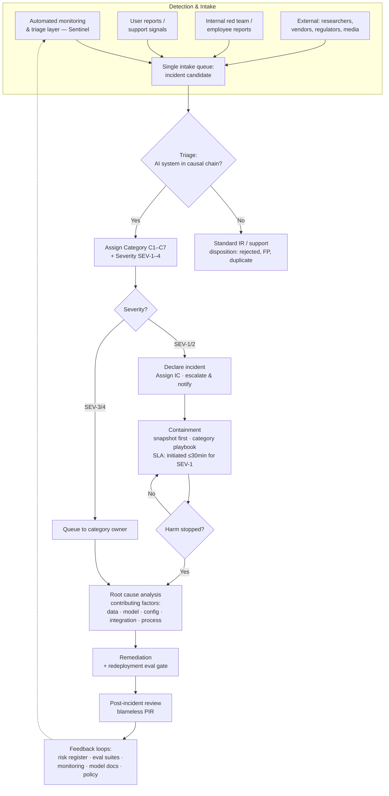

# AI Incident Response Playbook

**A framework-grounded incident response playbook for production AI systems** — anchored in NIST AI RMF and ISO/IEC 42001, built with the operational discipline of real Trust & Safety incident work.

📄 **[Read the full playbook](AI-Incident-Response-Playbook.md)** · also available as a [formatted Word document](AI-Incident-Response-Playbook.docx)

---

## What this is

A complete, adoptable incident response playbook for organizations deploying AI systems, covering the full lifecycle: detection & intake, triage & severity classification, escalation, containment, root cause analysis, remediation, and post-incident review — with RACI matrices, SLAs, reusable templates, and an explicit crosswalk to NIST AI RMF functions and ISO/IEC 42001 controls.

The playbook is written for a fictional crypto/fintech AI deployer (**Meridian Digital Assets**, running a fraud/AML model, an LLM support assistant, and vendor KYC verification) so that every rule is grounded in concrete examples. The org is fictional; the discipline is not.

## Why I built it

I've spent six years in customer and operations support — four of them in crypto — and since late 2024 I've been running Trust & Safety operations: account security, escalations, incident triage, RCA, and SOP design. As I move into AI governance, this playbook is my working answer to a question I kept asking: **how much of hard-won T&S operational discipline translates directly to AI incidents?** (Answer: most of it — but the AI-specific adaptations are where it gets interesting.)

## Design decisions worth arguing about

1. **Lifecycle-first, framework-mapped.** The document is organized by what a responder needs at 2 a.m., not by NIST function. Framework alignment lives in a crosswalk table (§2) that auditors can trace — because a playbook you can't use during an incident is compliance theater.

2. **Category and severity are orthogonal axes.** *What kind* of incident (C1–C7: harmful output, performance failure, data/privacy, security, bias/fairness, misuse, third-party) selects the containment playbook. *How bad* (SEV-1–4) selects speed and escalation. Conflating them either over-escalates trivia or under-escalates quiet catastrophes.

3. **"5 whys" doesn't survive contact with stochastic systems.** Model failures rarely have a single root cause, so RCA here is contributing-factors analysis across five layers: data, model, prompt/configuration, integration, and human process (§6.5).

4. **Automated triage suggests; humans ratify.** The playbook defines where an automated detection/triage layer sits in the process — and makes explicit that accountability never transfers to the tool (§6.2). Overrides are logged and become calibration data.

5. **Near-misses are first-class citizens.** SEV-4-NM events get mandatory lightweight review — the cheapest learning an incident program gets, and the one most programs throw away.

## Workflow at a glance



## Contents

| Section | What's in it |
|---|---|
| §0–1 | Document control, scope, and the boundary question: *what counts as an AI incident?* |
| §2 | NIST AI RMF × ISO/IEC 42001 crosswalk |
| §3 | Roles, RACI matrix, and a deliberate three-way accountability split |
| §4–5 | Two-axis taxonomy: 7 categories × 4 severity levels, classification rules, worked examples |
| §6 | Full lifecycle with workflow diagram, SLAs, escalation matrix, containment ladder, AI-adapted RCA |
| §7 | Program metrics (MTTD, recurrence, near-miss ratio, severity re-grade rate) |
| Appendix A–C | Templates: incident report, RCA, post-incident review |
| Appendix D | On-call severity quick-reference card |
| Appendix E | Tooling reference (informative) — where automation plugs into the process |

## Companion project: Sentinel

The playbook's detection & triage layer (§6.1, Appendix E) doubles as the specification for **Sentinel**, an automated AI-incident triage tool I'm currently building as a separate project. The playbook defines the process; Sentinel is being built to implement the front end of it. The two are deliberately decoupled — the playbook is adoptable with any tooling that preserves the described capabilities.

## Repository layout

The Markdown file is the single source of truth. The Word document is generated from it, so the two can never drift:

```bash
npm install && npm run build:docx
```

## License

Content licensed under [CC BY 4.0](LICENSE) — adapt it to your organization, with attribution.

---

*Built by Bruno Gonçales — Trust & Safety operations → AI governance. Feedback welcome, especially from people running AI incident response in production: what does this get wrong?*
